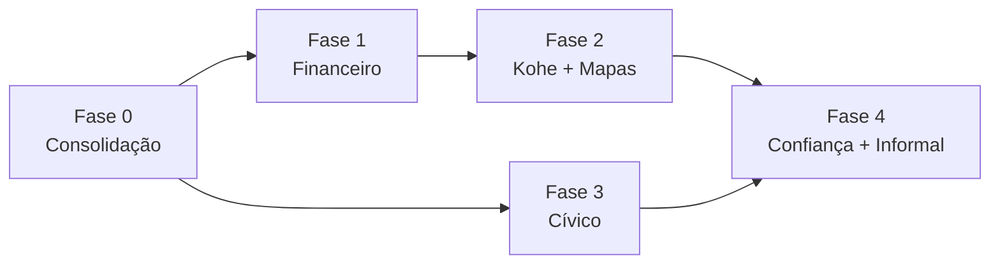

# Roadmap n8 — o sistema operacional do bairro

**Tese:** o n8 não é um catálogo de features locais. É a camada de confiança e
transações do bairro. O ativo é o grafo hiperlocal (quem faz o quê, quem é
confiável, o que o bairro precisa) — não as telas.

**Princípio de execução:** consolidar antes de inovar. Cada fase entrega algo
utilizável e prepara a seguinte. Nada relacionado a dinheiro acontece sem
trilha de auditoria e aprovação humana.

---

## Fase 0 — Consolidação

Fundação estável antes de construir dinheiro em cima.

- Painéis ligados a dados reais (fim dos mocks em Admin/Shopkeeper/Driver).
- `apiClient` central + hooks de dados (fim do axios manual repetido em ~10 telas).
- socket.io base (tempo real para Kohe e financeiro).
- Cadastro real: signup + seleção de bairro + recuperação de senha.
- Migrations versionadas com runner único; testes das rotas críticas.

## Fase 1 — Financeiro (o coração)

Todo real que entra — ou deveria entrar — é rastreável, dividido corretamente
e repassado sob aprovação.

- **Ledger de dupla-entrada**: `account`, `ledger_transaction`, `ledger_entry`.
  Cada transação soma zero; saldo por loja/entregador/admin/plataforma.
- **Pagamentos**: cartão, Pix, Apple Pay (iOS), dinheiro na entrega (com
  cálculo de troco), maquininha da loja, pagar no estabelecimento.
  Gateway: nxgateway (https://nxgateway.vercel.app/) com split nativo.
- **Off-platform**: dinheiro/maquininha/balcão não movem o gateway, mas geram
  lançamentos (loja fica devendo comissão). Recuperação: abatida do próximo
  repasse ou cobrança emitida (Pix/boleto/cartão).
- **Repasses**: ciclo configurável por admin/superadmin — quinzenal (padrão),
  semanal ou mensal. Lote de settlement calculado automático, aprovado
  manualmente: item a item, por grupo ou lote inteiro; itens podem ser retidos.
- **Auditoria**: registro imutável de quem aprovou o quê; flags de divergência.

## Fase 2 — Kohe + Mapas

Kohe é o módulo de entrega com **marca e identidade próprias** — soa como um
app integrado, com funcionamento próprio.

- Entregadores **cadastrados e validados**: a loja valida os seus (que podem
  ser da rede); admins ativam entregadores para a rede.
- Alocação: o lojista **direciona** o pedido ou solta em **sorteio**; pedido de
  entregador da rede é sorteado pela plataforma entre os elegíveis.
- Mapas **white-label sem limitação**: MapLibre GL + estilo próprio + tiles
  auto-hospedados. Rotas/ETA/turn-by-turn via engine própria (Valhalla/OSRM).
- Craft visual: **motinha** que rotaciona pelo heading e desliza suave;
  **rastro** percorrido sólido vs a percorrer tracejado; marcadores autorais
  para loja e destino. Localização ao vivo é do **pedido**, não da pessoa.

## Fase 3 — Cívico (a praça digital)

O motivo de abrir o app todo dia sem comprar nada.

- Denúncias e sugestões **públicas**, com **comentários** e **apoio** dos
  vizinhos (agregação).
- Órgãos e responsáveis **cadastrados na plataforma** (subprefeitura,
  vereador, concessionária, associação).
- Ao passar do limiar de apoio, o post é **recomendado/encaminhado** ao
  responsável da categoria. Ciclo visível: aberto → em análise → encaminhado
  → resolvido.

## Fase 4 — Confiança + Economia informal

- **Confiança privacy-first**: só avalia quem transacionou; endereço é
  verificado uma vez e nunca exibido (vira selo "Verificado no bairro");
  reputação como nível/badge; zero rastreio de pessoas.
- **Funil informal→formal**: classificados **gratuitos e limitados**; para
  expandir, o usuário **cria sua loja** → aprovação do admin → taxas
  configuradas pelo admin (alimentam o split da Fase 1).
- **Micro-vitrine recorrente** na camada de loja: cardápio da semana, pedido
  recorrente/assinatura, reputação acumulando.

---

## Decisões registradas

| Tema | Decisão |
|---|---|
| Storage de imagens | freeimage.host por enquanto (sem caixa para storage próprio); R2 no futuro |
| Fintech de bairro / fiado | **Fora** do produto |
| Concierge com IA | Não por agora |
| Entrega aberta (qualquer vizinho) | **Nunca** — contradiz o modelo Kohe |
| Ciclo de repasse padrão | Quinzenal |
| Rating | Sem vigilância: nada de rastrear pessoas ou expor endereço |
